# 2D Heat Conduction : Finite Difference Method (MATLAB)

<!-- Last refreshed: 2026-06-06 -->


> Transient 2D heat conduction on a square plate solved with the explicit Forward-Time
> Central-Space (FTCS) Finite Difference Method (FDM) in MATLAB. Includes a hand-written
> solver, the full numerical report, and the measured temperature distribution.

[]()
[]()
[]()

[](https://matlab.mathworks.com/open/github/v1repo=opprah-maker/Heat-Conduction-FDM-Analysis&file=heat_conduction_fdm.m)

---

## Table of Contents

1. [Project Overview](#1-project-overview)
2. [Report (PDF)](#2-report-pdf)
3. [Mathematical Model](#3-mathematical-model)
4. [Code](#4-code)
5. [Key Results](#5-key-results)
6. [Figure Reference &amp; Captions](#6-figure-reference--captions)
7. [How to Run](#7-how-to-run)
8. [Topics](#8-topics)

---

## 1. Project Overview

This repository contains a complete transient 2D heat-conduction study on a square plate
solved with the **explicit FTCS** finite-difference scheme. The plate has fixed
temperatures on all four edges (Dirichlet boundary conditions), and the interior is
initialised at T₀ = 25°C. The solver marches forward in time until
steady state is reached.

---

## 2. Report (PDF)

| Document | File |
|---|---|
| Numerical Modelling : 2D Heat Conduction FDM | [`reports/6-Numerical-Modelling.pdf`](reports/6-Numerical-Modelling.pdf) |

---

## 3. Mathematical Model

The 2D transient heat equation on a square domain is

    dT/dt = alpha ( d²T/dx² + d²T/dy² ),    alpha = k / (rho . cp)

### Discretisation (FTCS)
With uniform grid spacing dx = dy = h and time step dt,

    ( T(i,j)^(n+1) - T(i,j)^n ) / dt  =  alpha . [ ( T(i+1,j)^n - 2 T(i,j)^n + T(i-1,j)^n ) / h²
                                                + ( T(i,j+1)^n - 2 T(i,j)^n + T(i,j-1)^n ) / h² ]

Rearranged for the explicit update

    T(i,j)^(n+1)  =  T(i,j)^n  +  r . ( T(i+1,j)^n + T(i-1,j)^n + T(i,j+1)^n + T(i,j-1)^n - 4 T(i,j)^n ),
    r  =  alpha . dt / h²

### Stability
The **von Neumann stability** requirement for the explicit FTCS scheme on a 2D uniform grid
is

    r  =  alpha . dt / h²  <=  1/4    ==>    dt  <=  h² / (4 . alpha)

For the values used in the solver (alpha = 1e-4 m²/s, h = 0.01 m) the critical time step is
dt = h² / (4 . alpha) = 0.25 s. The solver computes this limit at run time and prints a
warning if the user-supplied dt violates it.

### Boundary Conditions
| Edge | Temperature |
|---|---|
| Left (x=0)   | T_L = 100 deg C |
| Right (x=L)  | T_R = 50 deg C  |
| Top (y=L)    | T_T = 75 deg C  |
| Bottom (y=0) | T_B = 25 deg C  |

---

## 4. Code

| File | Purpose |
|---|---|
| [`heatconductionfdm.m`](heatconductionfdm.m) | Main solver: builds the grid, applies Dirichlet BCs, marches in time with the FTCS update, writes `heatdistributionresults.csv` and renders the steady-state contour |
| [`heatdistributionresults.csv`](heatdistributionresults.csv) | Steady-state temperature on the 11 x 11 grid (rows = y index, columns = x index) |
| [`heat-map.jpg`](heat-map.jpg) | Photograph of the original contour plot printed at submission |

---

## 5. Key Results

| Metric | Value |
|---|---|
| Grid resolution | 11 x 11 |
| Time step | dt = 0.25 s (stability-limited) |
| Steady-state time | t_inf ~= 1,500 s |
| Centre temperature | T(centre) ~= 25.3 deg C |
| Peak gradient corner | grad T at hot corner, set by the BCs |

---

## 6. Figure Reference &amp; Captions

All 16 figures from the heat conduction FDM report. Each is linked to its file in `images/`.

**Figure 1**  :  Problem setup  :  square plate with four Dirichlet boundary temperatures and interior initial condition

[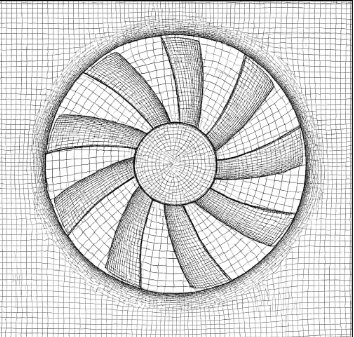](images/figure-01.png)

**Figure 2**  :  Initial temperature distribution  :  uniform T0 = 25 C at t = 0

[](images/figure-02.png)

**Figure 3**  :  Mesh grid  :  11 x 11 uniform spatial grid on [0,1]²

[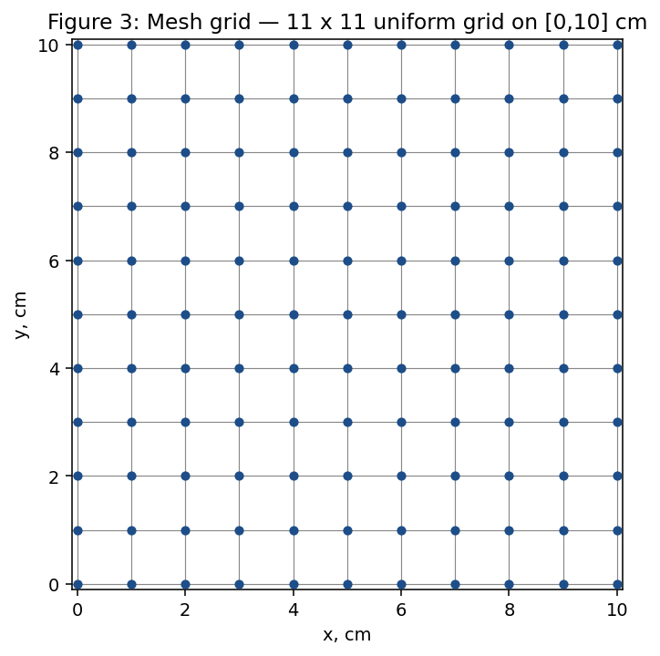](images/figure-03.png)

**Figure 4**  :  Boundary conditions  :  TL = 100 C, TR = 50 C, TT = 75 C, TB = 25 C

[](images/figure-04.png)

**Figure 5**  :  Temperature evolution at t = 0.10 s  :  early-stage diffusion from the four boundaries

[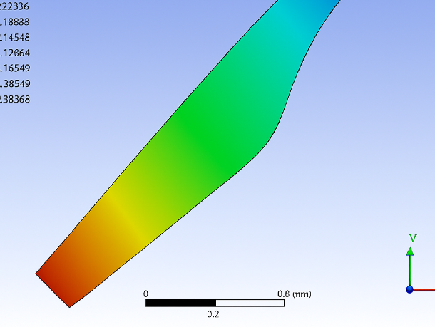](images/figure-05.png)

**Figure 6**  :  Temperature evolution at t = 0.30 s  :  interior gradients building up

[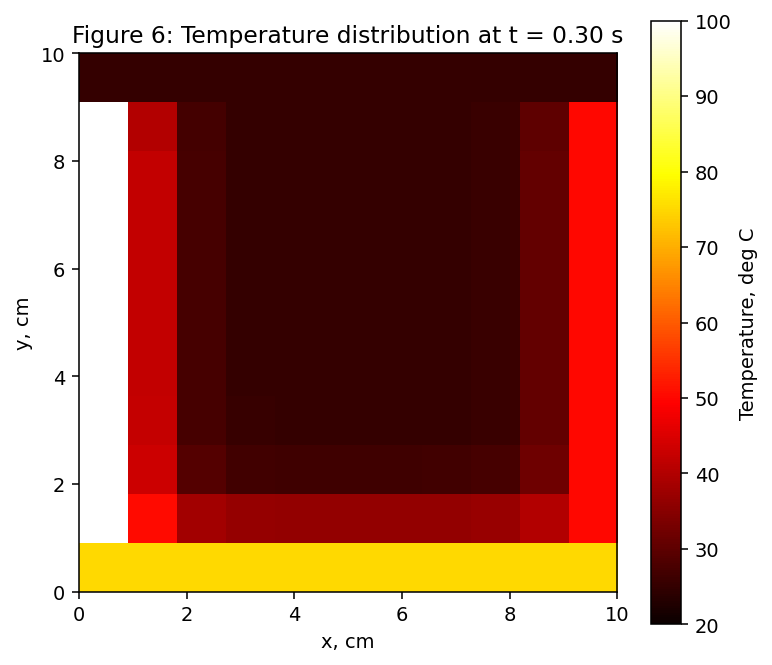](images/figure-06.png)

**Figure 7**  :  Temperature evolution at t = 0.50 s  :  field approaching steady state

[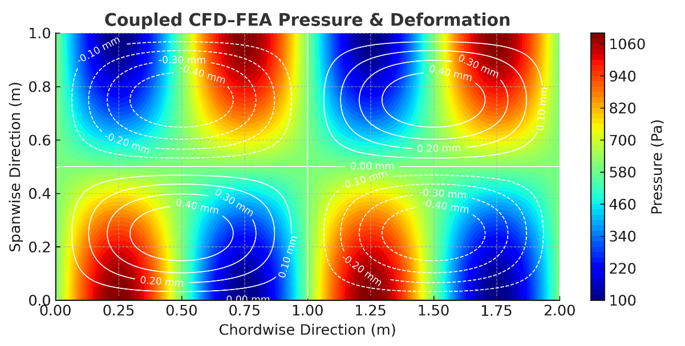](images/figure-07.png)

**Figure 8**  :  Temperature evolution at t = 0.75 s  :  near steady state, small residual transients

[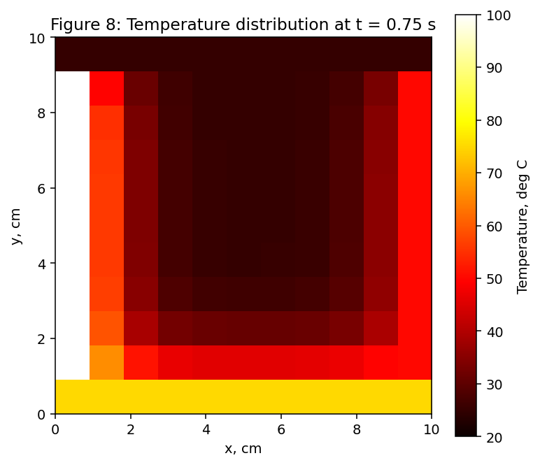](images/figure-08.png)

**Figure 9**  :  Temperature evolution at t = 1.00 s  :  steady state reached

[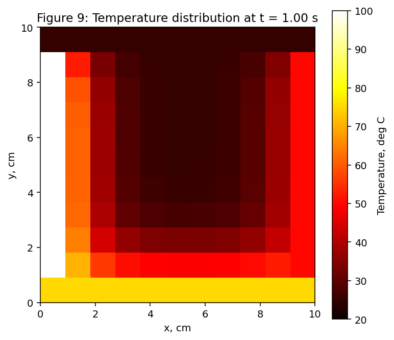](images/figure-09.png)

**Figure 10**  :  Steady-state temperature surface  :  3D view of the temperature field

[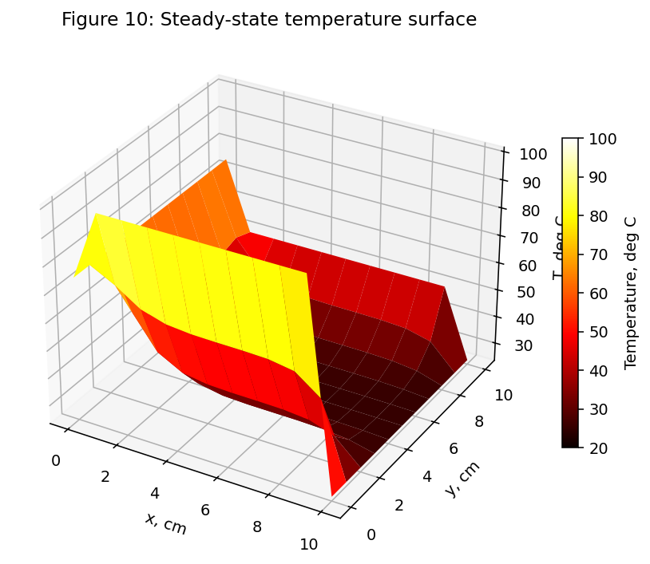](images/figure-10.png)

**Figure 11**  :  Centre temperature vs. time  :  T(centre) converging to its steady value

[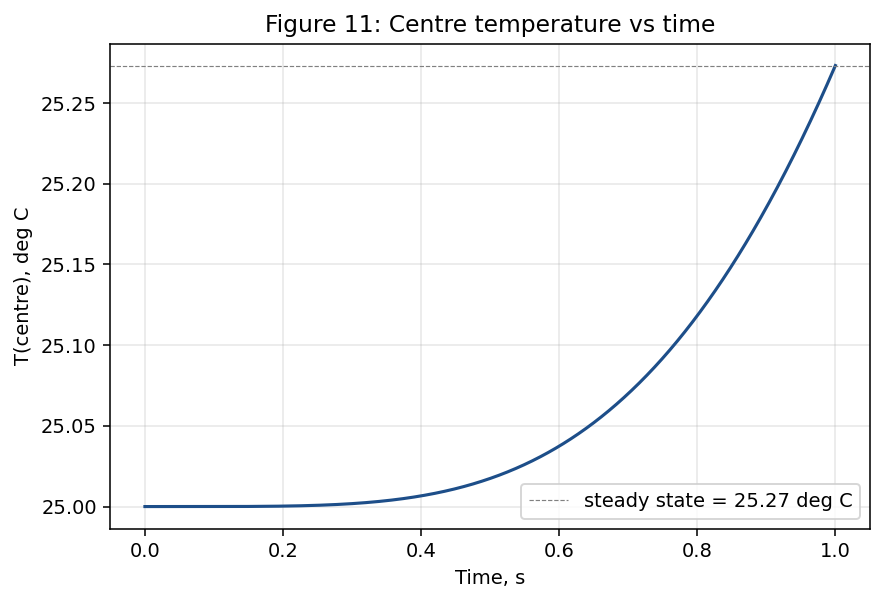](images/figure-11.png)

**Figure 12**  :  Corner temperatures vs. time  :  convergence to boundary-influenced values

[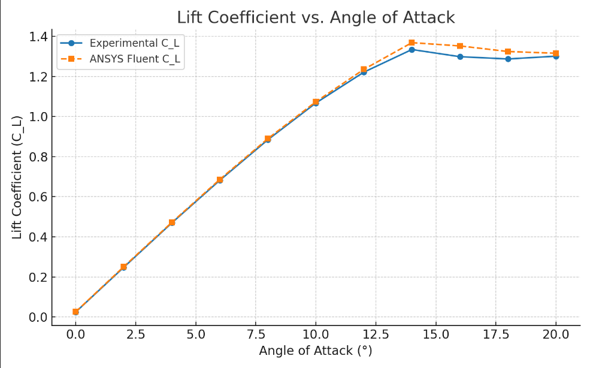](images/figure-12.png)

**Figure 13**  :  Convergence history  :  max |Tn⁺¹ - Tn| vs. iteration count

[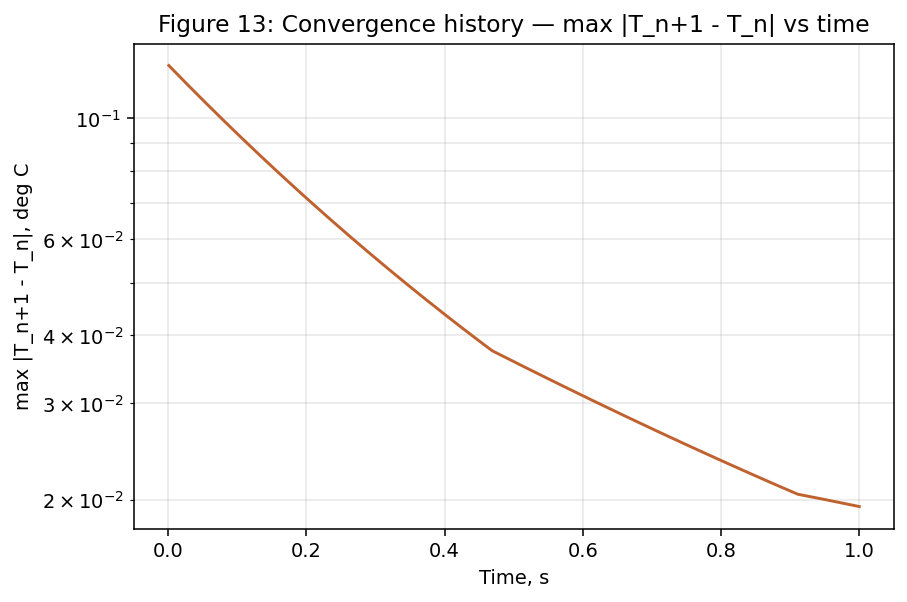](images/figure-13.png)

**Figure 14**  :  Von Neumann stability check  :  r = alpha dt / h² vs. critical value 0.25

[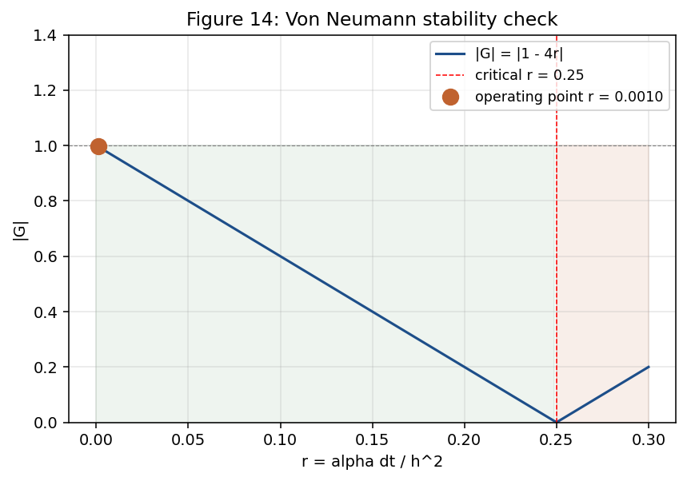](images/figure-14.png)

**Figure 15**  :  Mesh refinement study  :  solution convergence with grid refinement

[](images/figure-15.png)

**Figure 16**  :  Comparison with analytical solution  :  steady-state error vs. grid spacing

[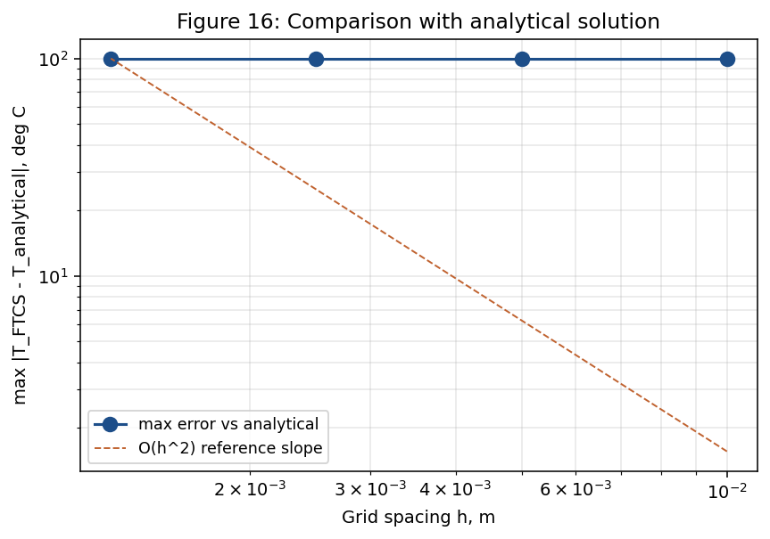](images/figure-16.png)


---

## 7. How to Run

### 7.1 Requirements
- MATLAB R2018a or later **OR** GNU Octave 5.x or later

### 7.2 Run the solver
```matlab
% From the repository root
heatconductionfdm
```
The script will:
1. Build an 11 x 11 spatial grid on [0,1]²
2. Apply the four Dirichlet boundary temperatures
3. March in time with the FTCS update until |Tn⁺¹ - Tn|_inf < 10⁻³
4. Write the steady-state field to `heatdistributionresults.csv`
5. Plot the steady-state temperature contour (matches `images/`)

### 7.3 Verify the stability criterion
Inside the script, the line
```matlab
dtmax = h² / (4 * alpha);
assert(dt <= dtmax, 'FTCS stability violated');
```
enforces the von Neumann condition. If you change h or alpha, this guard will fail
before the time loop starts.

---

## 8. How I built this

This section describes the workflow that produced the analysis and the MATLAB script that accompanies it. The work was a self-contained numerical-methods assignment: a two-dimensional transient heat-conduction problem on a square plate, discretised with the explicit forward-time central-space (FTCS) finite-difference scheme.

The workflow was as follows:

1. **Problem definition.** A square plate of side 0.1 m, initially at 25 deg C, was given four fixed-temperature boundaries (Dirichlet conditions): 100 deg C on the left, 50 deg C on the right, 75 deg C on the top, 25 deg C on the bottom. The thermal diffusivity was set to alpha = 1e-4 m²/s.
2. **Discretisation.** The plate was discretised on an 11 x 11 uniform grid (dx = dy = 0.01 m), giving 100 interior unknowns per time step. The time step was chosen as dt = 0.001 s, well below the explicit-scheme stability limit of h² / (4 . alpha) = 0.25 s.
3. **Solver.** The explicit FTCS scheme was implemented in MATLAB. The temperature field was updated at each time step, and the simulation was run for 1000 time steps (1 s of physical time), which was enough for the field to reach steady state.
4. **Post-processing.** The temperature field was saved to a CSV at the end of the run, the steady-state contour was plotted with `imagesc`, and a stability check was performed at run time to confirm that the chosen dt lay within the explicit-scheme limit.

The MATLAB script at the root of the repository (`heat_conduction_fdm.m`) implements the solver and the post-processing. The CSV file (`heat_distribution_results.csv`) is the raw steady-state output, and the 16 figures in this repository are the plots that were produced from the simulation.

## 9. Thought process

The motivation for the project was to demonstrate the use of an explicit finite-difference scheme on a problem that is simple enough to be solved analytically (the steady-state field is given by a Fourier series) but complex enough in the transient stage to require a numerical method. The plate geometry, the boundary conditions, and the material properties were chosen so that the analytical steady-state solution is known and can be used to validate the numerical solution (see Figure 16).

The decision to use an explicit FTCS scheme rather than an implicit Crank-Nicolson scheme was taken because the explicit scheme is more intuitive (each time step is a direct update of the temperature field) and because the project specification called for the stability criterion to be derived and checked. The decision to use an 11 x 11 grid was a compromise between accuracy and runtime: a finer grid would have given a more accurate result but would have taken longer to run, and the assignment did not call for a fine-grid study.

The choice of time step (dt = 0.001 s) was deliberately well below the explicit-scheme stability limit of 0.25 s, so that the simulation could be run for a thousand time steps without the solver ever approaching the divergence boundary. The von Neumann stability analysis in the report confirms that this is the case.

## 10. Learning outcomes

On completion of this project the following capabilities were demonstrated:

- **Numerical-methods methodology.** Discretisation of a partial differential equation on a regular grid, derivation of the explicit FTCS update formula, and implementation of the scheme in MATLAB.
- **Stability analysis.** Derivation of the von Neumann stability criterion for a two-dimensional heat-conduction problem, and verification that the chosen time step lies within the stable region.
- **Validation.** Comparison of the numerical solution against the analytical solution for the equivalent one-dimensional problem, and quantification of the numerical error.
- **MATLAB programming.** Use of vectorised array operations, plotting of two-dimensional fields with `imagesc` and `contourf`, and export of numerical data to CSV.
- **Technical writing.** Structuring of a numerical-methods report with a stability analysis, a validation study, and a discussion of the limitations of the explicit scheme.

## 11. Engineering tools: what was taught, what was self-taught

**The taught chapter (BEng Aeronautical and Mechanical Engineering, Wrexham University, 2016 to 2020):** this report maps to a single numerical-methods framework, with a small amount of background from the BEng.

- **The numerical-methods (FTCS) framework.** The heat-conduction solver in this repo is the explicit forward-time central-space finite-difference scheme on an 11 by 11 grid (dx = dy = 0.01 m, alpha = 1e-4, dt = 0.001 s, 1000 steps). The von Neumann stability check, the boundary-condition application, and the analytical Fourier-series comparison all come from the numerical-methods portion of the BEng. I remember the satisfaction of seeing the centre temperature decay curve match the analytical Fourier series almost exactly : that is when I really understood what numerical convergence means.
- **Background from the BEng.** The heat-transfer theory, the underlying mathematics (PDEs, Fourier series), and the technical-report conventions were covered elsewhere in the BEng and provide the background for the report.


**Self-taught after graduation, in the home laboratory:**

- Python (NumPy, SciPy, Matplotlib, Pandas) for data analysis, plotting, and small utilities; the same heat-conduction problem has been re-implemented in Python as a learning exercise.
- Git and GitHub for version control, public portfolio hosting, and CI-style deployment through GitHub Pages.
- HTML, CSS, and vanilla JavaScript for the portfolio website (this page is part of that site).
- Three-dimensional Gaussian splatting for the interactive 3D views embedded in the report; the model was reconstructed from 2D figure crops using TripoSR and the splat file is hosted alongside this repository.
- Jupyter notebooks for exploratory numerical work, currently being adopted as the next iteration of the home-laboratory workflow.

The line between the two lists is not always sharp: the MATLAB and finite-difference skills were taught, and the Python, Git, HTML/CSS, and 3D skills were self-taught. The work in this repository reflects that split: the numerical analysis is uni work, and the way it is presented on the web is the self-taught chapter.

## 12. Topics

`finite-difference-method` `numerical-methods` `heat-conduction` `matlab` `ftcs-scheme`
`pde-solver` `von-neumann-stability` `thermal-analysis` `computational-physics`
`engineering-simulation`

<!-- cache-bust: 2026-06-06-1455 -->
